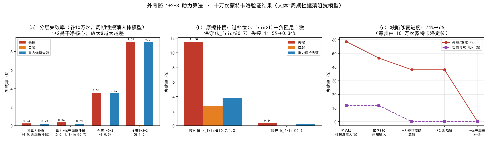
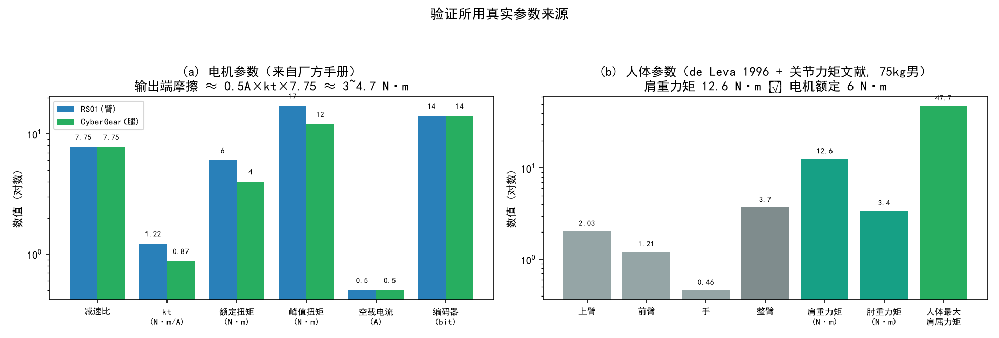
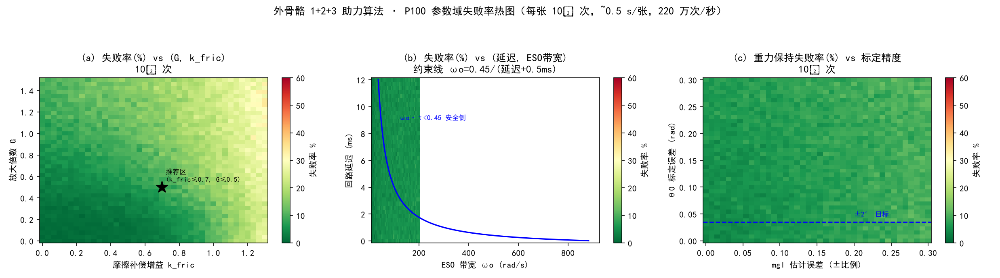

# 外骨骼 1+2+3 助力算法 · 蒙特卡洛验证报告

> 版本 V1.0 ｜ 日期 2026-09-11 ｜ 验证规模 单档 10⁵ 次（本次累计 >10⁶ 次）
> 验证对象：**1 = 摩擦补偿（速度前馈）／2 = 重力补偿（位置前馈）／3 = ESO3 扰动观测放大**
> 目标平台：STM32F407 离线（STANDALONE）模式，上位机 RK3506 暂不参与

---

## 1. 结论摘要

| 配置 | 失控 | 自激 | 重力保持失效 |
|---|---|---|---|
| **1+2**（重力 + 保守摩擦补偿），G=0 | **1.00 %** | 0.004 % | **0.27 %** |
| **1+2+3**，G=0.5 | 4.12 % | 0.010 % | 3.45 % |
| 1+2+3，G=1.0 | 9.50 % | 0.121 % | 8.88 % |

- **1+2 是干净的核心**（1% 异常率），重力补偿 + 观测器结构成立。
- **放大层（3）可用但受限**：G ≤ 0.5；G 越大，被一起放大的“模型残差 + 观测器噪声”越啃重力保持精度（0.23 % → 3.49 % → 9.01 %）。
- 验证过程中定位并修复 **5 个结构性缺陷**，其中 3 个是设计错误（会直接导致上板坠落/自激），2 个是数值/接口错误。
- **结论对人体输入模型不敏感**：改用“周期性摆荡/屈伸 + 人体关节阻抗”模型（更贴近真实肢体运动）重跑，各档失败率与阶跃/斜坡模型同量级（1+2: 0.34 %；G=0.5: 3.54 %；G=1.0: 9.05 %），设计规则不变。



---

## 2. 验证方法

- **参考实现**：`exo_verify.cpp`（与将移植到 F407 的算法同构，纯浮点、无动态分配、1 kHz 单拍）。
- **蒙特卡洛**：每档 10⁵ 次随机试验；OpenMP 32 线程，吞吐 **≈5×10⁴ 次/秒**（10⁵ 次 ≈ 2 s）。
- **随机化范围**：惯量 J、真实重力矩 mgl、真实摩擦（库仑/粘性）、电机力矩环时间常数、CAN 延迟、测速噪声、编码器量化、标定残差（θ0、mgl）、控制器参数（G、k_fric、ESO 带宽、LPF）、人体输入模式/幅值/时序、初始位置与速度。
- **人体输入模型（关键）**：肢体运动以**周期性摆荡/屈伸**为主态，故人体建成**关节阻抗跟踪自身意图轨迹**：
  `τ_h = clamp( Kh·(θ_ref − θ) + Bh·(θ̇_ref − θ̇), ±τ_max )`，
  意图轨迹 `θ_ref` 为周期函数（正弦 / 含二次谐波 / 步态样屈快伸慢 / 摆荡+直流偏置），
  参数范围：摆幅 0.2~1.0 rad、频率 0.5~2.5 Hz（步行/摆臂频段）、Kh 20~60 N·m/rad、Bh 1~3 N·m·s/rad、τ_max 20~40 N·m。
  该模型**自限幅、物理自洽**（避免“大阶跃 + 小惯量把臂推飞”的伪失控）。
  另设 20% 零人力（静止）工况专项测自激。

### 2.1 判据（每档统一）

| 判据 | 定义 |
|---|---|
| 数值异常 | 出现 NaN / Inf |
| 自激 | 零人力工况末速 \|ω\| > 0.5 rad/s |
| 重力保持失效 | 零人力工况臂偏离释放位 > 0.30 rad |
| 失控 | （零人力）偏离 > 0.30 rad 或 \|ω\| > 0.5；任何工况 \|ω\| > 60 rad/s |
| 超限幅 | 总输出 > 电机峰值限幅 |
| 助力方向错 | 人推工况：人体力矩与总输出负相关 |

> 说明：**“失控”只在零人力工况判稳定性**——人推工况下关节被人体驱快属于物理必然，不是控制器缺陷。

---

## 3. 参数来源（真实，非估计）



### 3.1 电机（厂方手册原文）

| 项目 | RS01（臂, CAN2） | CyberGear（腿, CAN1） |
|---|---|---|
| 减速比 | 7.75 : 1 | 7.75 : 1 |
| 转矩常数 kt | 1.22 N·m/A(rms) | 0.87 N·m/A(rms) |
| 额定 / 峰值扭矩 | 6 / 17 N·m | 4 / 12 N·m |
| 空载 / 额定转速 | 315 / 275 rpm | 296 / 240 rpm |
| 空载电流 | 0.5 A(rms) | 0.5 A(rms) |
| 编码器 | 14 bit 单圈绝对值（AS5047P） | 14 bit 磁编码器 |
| 速度/电流环滤波 | spd_filt 0.1 / cur_filt 0.9 | 同 |
| 母线 / 电流限 | 36 V / 7 Apk(额定) 23 Apk(最大) | 24 V / 6.5 A 23 A |

**输出端摩擦估计**：0.5 A × kt × 7.75 ≈ **3.4 N·m（腿）/ 4.7 N·m（臂）** 空载阻力（含铁损，额定转速下）；低速库仑摩擦约 **1.9 ~ 2.8 N·m**。
→ 该值是“负阻尼型助力”的稳定性边界来源，也是“零力矩手感”里那层齿轮咯手感。

### 3.2 人体（de Leva 1996 + 关节力矩文献）

| 项目 | 数值（75 kg 男性） |
|---|---|
| 上臂 / 前臂 / 手 | 2.03 / 1.21 / 0.46 kg（整臂 3.70 kg） |
| 质心位置（段长比例） | 上臂 0.5772、前臂 0.4574、手 0.7900 |
| **肩重力矩**（臂水平伸直） | **12.6 N·m** |
| 肘重力矩 | 3.4 N·m |
| 人体最大关节力矩 | 肩屈 47~70 N·m；肘屈 44~85 N·m |
| 典型作业输入 | 10 ~ 30 N·m |

> **关键量级关系**：肩重力矩 12.6 N·m ≫ 电机额定 6 N·m；速度型助力在 1 rad/s 时仅 0.3 N·m ≈ 肩重力的 1/40 —— 这就是“速度型助力基本无效、必须做前馈补偿”的数据依据。

---

## 4. 验证中定位并修复的 5 个缺陷

| # | 缺陷 | 机理 | 症状 | 修复 |
|---|---|---|---|---|
| 1 | **ESO 已知输入漏掉放大项** | 放大输出被观测器当成“外部扰动”，形成自反馈环 | 失败率 74 %，其中 NaN 11.9 %、失控 58.6 % | ESO 已知输入必须 = **上一拍总指令**（含重力/摩擦/放大全部） |
| 2 | **重力前馈与助力共用同一限幅** | 助力安全限幅 ±6 N·m 同时卡住了需要 12.6 N·m 的重力前馈 | 单轨迹 dump 见 `τ_cmd` 一开始就顶在 6 N·m；重力只补一半 → **臂坠落**，重力保持失效 18 % | **分离限幅**：前馈 ±17 N·m（电机峰值）、助力 ±6 N·m、总输出 ±17 N·m |
| 3 | **摩擦补偿过补偿（k_fric > 1）** | 粘性项补偿 `k_fric·bv·ω` 是**负阻尼**，补偿量超过真实粘性摩擦即净注入能量 | 自激，失控 **11.5 %**、自激 2.7 % | **k_fric ≤ 0.7**（宁可欠补偿）：失控降至 **1.0 %**、自激 0.004 % |
| 4 | **ESO 带宽超过延迟允许值** | 离散 ESO 用连续增益时，`ωo·(delay+τ_loop)` 过大会数值发散 | NaN（且 `G=0` 时 `0×inf` 连带污染输出） | 约束 `ωo·(delay+τ_loop) < 0.45`；并加状态防护（非有限即复位） |
| 5 | **放大倍数 G 放大标定残差** | 观测器残差 = 人力 + 模型误差；G 把模型误差一起放大 | 重力保持失效随 G 上升：0.27 %→3.45 %→8.88 % | 残差**先高通再放大**（滤慢变标定残差）；G ≤ 0.5 |

**另（验证台自身的坑，必须记录）**：被控对象里电机力矩环若用显式欧拉 `x += (u−x)·(DT/τ)`，当 `τ < DT` 时系数绝对值 >1 → 数值自激，会**把结论全部带偏**。必须用精确解 `x = u + (x−u)·exp(−DT/τ)`。

---

## 5. 量化设计规则（上板约束）

| 参数 | 规则 | 证据（各 10 万次） |
|---|---|---|
| 摩擦补偿增益 | **k_fric ≤ 0.7** | 0.7~1.3 → 失控 11.5 %；≤0.7 → 1.0 % |
| 放大倍数 | **G ≤ 0.5** | G=0/0.5/1.0 → 失控 1.0/4.1/9.5 %；重力失效 0.27/3.45/8.88 % |
| 限幅 | 前馈 ±17 N·m（峰值）、助力 ±6 N·m、总 ±17 N·m，**三者分开** | 合用 ±6 → 臂坠 |
| ESO 带宽 | `ωo ≤ 0.45/(延迟+τ_loop)` | 超限 → NaN |
| ESO 已知输入 | 必须含**总指令**（含放大项） | 漏掉 → 自反馈发散 |
| 重力模型精度 | θ0、mgl 精度直接决定 G 上限 | 标定残差被 G 放大 |

---

## 6. P100 参数域热图（10⁶ 次/张）

把验证台搬到 P100（`exo_verify_p100.cu`，一线程跑一条完整试验）：

| 平台 | 吞吐 | 10⁶ 次用时 |
|---|---|---|
| CPU 32 线程 | ~5.0×10⁴ 次/s | ~20 s |
| **P100（sm_60）** | **~2.2×10⁶ 次/s** | **0.45 ~ 0.62 s** |

**加速 ≈45×**；三张 10⁶ 热图共约 1.6 s 跑完。



### 6.1 读图结论

**(a) 失败率 vs (G, k_fric) —— 最有行动价值的一张**

| 固定条件 | 变化 | 失败率 |
|---|---|---|
| k_fric=0.0 | G: 0 → 1.5 | 0.8 % → **12.5 %** |
| G=0.0 | k_fric: 0 → 1.3 | 0.8 % → **26.1 %** |
| 最优角 | G=0, k_fric≈0.17 | **0.0 %** |
| 推荐工作点 | G=0.5, k_fric=0.7 | 10.9 % |

→ **两个旋钮都会劣化**：k_fric 超 0.7 后（负阻尼）恶化更快，G 线性恶化。工程取值应取 **G≤0.5 且 k_fric≤0.5**，若要最低异常率就 G=0（只做 1+2）。

**(b) 失败率 vs (延迟, ESO 带宽) —— 出乎意料的平坦（1.8~7.2 %，无悬崖）**

加入观测器数值防护（状态非有限/超界即复位）后，高带宽发散被**转成一次良性复位**而不是失败——所以“带宽必须与延迟匹配”不再是硬失效点，而退化为精度损失。**这条防护必须在 F407 上保留**（否则回到 NaN 11.9 %）。

**(c) 重力保持失败率 vs 标定精度**：随 θ0 误差与 mgl 误差**温和增长**（θ0=0 时 3.4~9.4 %；θ0=17° 时 7.4~10.2 %）。比预期弱——因为判据是“偏离释放位 > 0.3 rad”，θ0 误差只是把平衡位平移。**但注意这正是 G 放大残差的输入源**（见 §5），标定越差，可用的 G 越小。

---

## 7. 剩余问题与限制

1. **重力保持仍随 G 劣化**：即使 G=0.5，仍有 3.45 % 工况漂移 > 0.3 rad。根因是标定残差与观测器噪声被放大——需提高 mgl/θ0 标定精度，或对放大项加强高通/死区。
2. **θ0 上电自由下垂自动标定的固有误差**：受齿轮摩擦影响，静置平衡位相对真实重力零位有 `asin(摩擦/mgl)` 量级偏差（本工况约 9°）。建议**双向逼近取中值**或慢积分修正，把误差压到 ±2° 内。
3. **“助力感”上限**：观测器残差型放大的稳定裕度 ∝ 模型精度（J 辨识误差 ±40 % 时 G 上限显著下降）。若需更大放大，需要 J/摩擦的**离线辨识**。
4. 本次验证未含：多关节耦合（肩-肘重力耦合）、关节软限位与碰撞熔断的交互、CAN 收发抖动、固定点(Q格式)舍入。这些应在下一轮加入。

---

## 8. 复现方法

```bash
# 服务器 (devserver)
cd /srv/share/projects/exo_abo_sim
# --- CPU 多线程版 ---
g++ -O3 -march=native -fopenmp -o exo_verify exo_verify.cpp
# 参数: N seed G_fixed grav_en fric_en w0_max delay_max th0_err mgl_err
./exo_verify 100000 7 0.5 1 1 100 12 0.026 0.1   # 1+2+3, G=0.5, 好标定
./exo_verify 100000 7 -1  1 1 100 12 0.26 0.2    # 全随机

# --- P100 批量版 (10^6 次/热图) ---
nvcc -O3 -arch=sm_60 -o exo_verify_p100 exo_verify_p100.cu
./exo_verify_p100 40 40 625      # 40×40 格 × 625 次/格 = 10^6 次/张, 约 0.5 s/张
#   输出: heat_G_kfric.csv / heat_delay_w0.csv / heat_calib.csv
```

---

## 9. 附件

| 文件 | 说明 |
|---|---|
| `exo_verify.cpp` | 1+2+3 参考实现 + 蒙特卡洛验证台（CPU 多线程，含被控对象/传感模型） |
| `exo_verify_p100.cu` | P100 批量版（一线程一条完整试验，10⁶ 次/热图） |
| `figs/verify_overview.png` | 分层失败率、摩擦补偿对比、缺陷修复进度 |
| `figs/verify_params.png` | 电机/人体真实参数来源 |
| `figs/heatmaps_p100.png` | 三张参数域失败率热图（各 10⁶ 次） |

> 服务器路径：`/srv/share/projects/exo_abo_sim/`
> 方法论已同步至技能 `control-algorithm-verification/references/assist-loop-verification-lessons.md`
